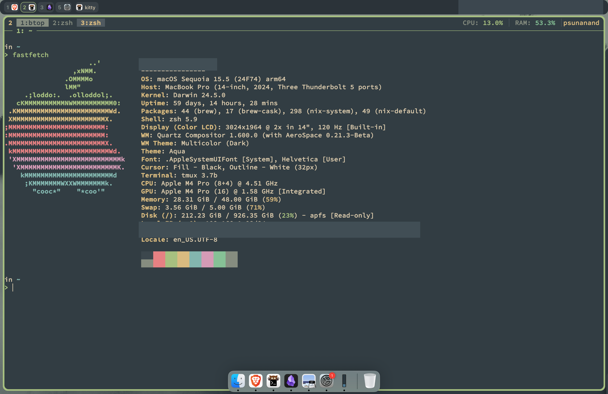

# MK's dotfiles (macOS)



## System sync

Run the complete setup or choose a focused target:

```sh
./sync.sh
./sync.sh packages
./sync.sh dotfiles
./sync.sh macos
```

Homebrew cleanup is opt-in because it removes packages that are not listed in
the Brewfile:

```sh
./sync.sh packages --cleanup
```
